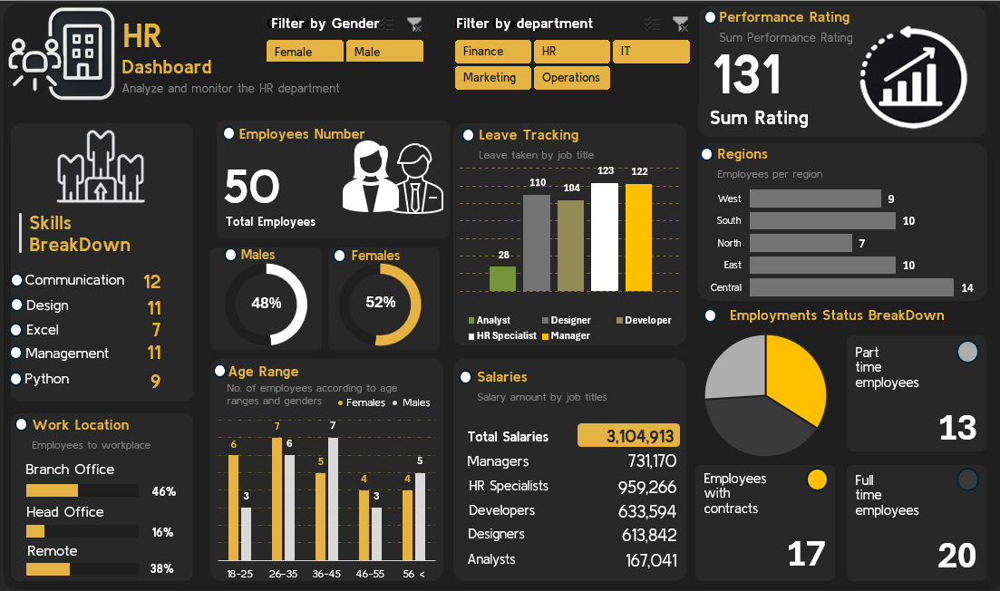

# 📈 HR Analytics Dashboard Project

## 🔹 Project Overview
This project presents an HR Analytics Dashboard built using Microsoft Excel.  
The dashboard provides insights into employee distribution, attrition trends, and department performance.

---

## 🔹 Tools & Techniques Used
- Microsoft Excel
- Pivot Tables
- Data Cleaning
- Charts & Dashboard Design

---

## 🔹 Dataset Description
The dataset includes:
- Employee ID
- Department
- Gender
- Age
- Salary
- Job Role
- Attrition Status

---

## 🔹 Key Insights
- Employee distribution by department.
- Gender ratio analysis.
- Attrition rate calculation.
- Salary distribution insights.
- Department-wise workforce trends.

---

## 🔹 Business Impact
The dashboard helps HR teams:
- Monitor attrition rates.
- Understand workforce demographics.
- Improve employee retention strategies.

---

## 🔹 Dashboard Preview
(Add your screenshot here)

---

## 🔹 How to Use
1. Download the Excel file.
2. Open in Microsoft Excel.
3. Explore the dashboard sheet for insights.

---

## 👨‍💻 Author
Aakash Kumar